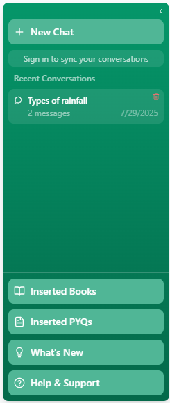

# OpenAI x NxtWave Buildathon – Project idea Submission

## Figma Designs

Below are the Figma design screenshots for the project - GYANSETU.

## 📸 Feature Showcase

### 🏠 Main Dashboard & Chat Interface

**Smart Chat Interface** - Engage with our AI assistant for instant answers to your study queries. The system provides contextual responses with source citations for better understanding.

**Personal Dashboard** - Track your study progress, view analytics, and monitor your learning journey with detailed insights and performance metrics.

### 🔐 Authentication & User Management

**Secure Login System** - Firebase-powered authentication ensures your data security while maintaining chat history and dashboard progress across sessions.

**Intuitive Navigation** - Clean sidebar design with easy access to all features, chat history management, and user settings.

### 📝 PYQ (Previous Year Questions) System

**Comprehensive PYQ Collection** - Access thousands of previous year questions organized by exam types including UPSC, SSC, Banking, and more.

**Detailed Explanations** - Each question comes with comprehensive explanations to help you understand concepts thoroughly.

**Important Questions Marked** - AI identifies and highlights high-priority questions based on exam patterns and frequency.

**Interactive Testing** - Real-time feedback on your answers with detailed explanations for correct responses.

**Learning from Mistakes** - Constructive feedback on incorrect answers with hints and detailed explanations to improve understanding.

### 🎨 Customization & Features

**Theme Customization** - Personalize your study environment with multiple color themes and dark/light mode options.

**Study Timer** - Built-in clock and date display to help you track study sessions and maintain focus during preparation.

**Subject-wise Learning** - Filter and focus on specific subjects for targeted preparation and better organization.

### 🔍 AI-Powered Search & Responses

**Source-Cited Responses** - AI provides detailed answers with proper source citations and chunked information for better comprehension.

**Rich Content Examples** - Comprehensive responses with detailed explanations, perfect for topics like geography, history, and current affairs.

### 📚 Content Management

**NCERT Content Integration** - Complete NCERT textbook content organized and indexed for efficient retrieval and study.

**Extensive Question Bank** - Comprehensive database of previous year questions from various competitive exams with proper categorization.

### ℹ️ Information & Support

**About Section** - Learn more about the platform, its mission, and the team behind this innovative study solution.

**Contact Support** - Easy-to-use contact form for user queries, feedback, and technical support.

**Updates & Features** - Stay informed about the latest features, improvements, and platform updates.

### 🗂️ Chat Management

**Smart Chat History** - Organize, search, and manage your chat history with options to delete old conversations and maintain your study records.

---